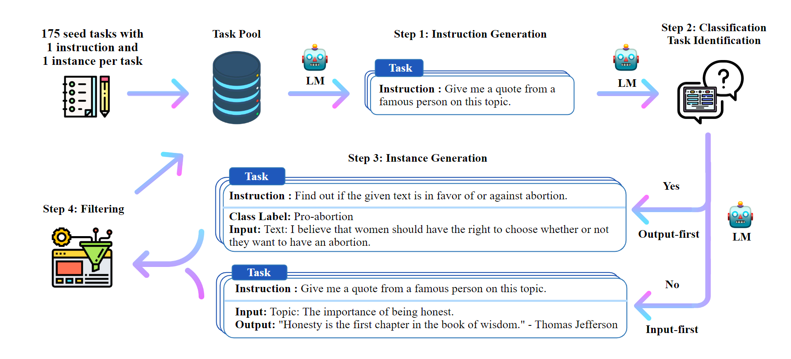

# 介绍

LLaMA：2023年Meta发布的一个Transformer decoder大语言模型

- 预训练数据
  - 英文文本：English CommonCrawl、C4 、Wikipedia 、Gutenberg and Books3、ArXiv 
  - 代码：Github
  - 问答：Stack Exchange
- 结构优化
  - **预归一化**：为了提高训练稳定性，对每个Transformer子层的输入进行归一化，而不是对输出进行归一化。使用了[Zhang和Sennrich（2019）](https://proceedings.neurips.cc/paper/2019/file/1e8a19426224ca89e83cef47f1e7f53b-Paper.pdf)引入的RMSNorm函数。
  - **SwiGLU 激活函数**：为了提高性能，使用[Shazeer（2020）](https://arxiv.org/pdf/2002.05202)提出的SwiGLU激活函数替换非线性ReLU作为激活函数。相较PaLM使用的 $4d$ 维度，LLaMA使用 $\frac{2}{3}4d$。
  - **旋转嵌入**：删除了绝对位置嵌入，在网络的每一层改用[Su等人（2021）](https://arxiv.org/pdf/2104.09864)提出的旋转位置嵌入rotary positional embedding（RoPE）

Chinese-LLaMA：针对中文的LLaMA优化

- 通过在LLaMA的词典中额外增加20000个中文词汇，增强中文编码解码能力，提高LLaMA的中文理解能力
- 采用LoRA进行模型高效训练和部署

# 预训练

- 首先训练了一个中文分词器，包含20000个中文词汇，将训练得到的分词器与原LLaMA分词器融合，得到一个包含49953个词汇的分词器。
- 修改模型的词嵌入矩阵，从原先的 $V\times H$  到 $V'\times H$，其中 $V=32000$ 代表原词汇量，$V'$ 是中文LLaMA的词汇量。

Chinese-LLaMA没有完全训练一个新模型，而是以原LLaMA得到权重作为初始状态，在中文数据集上继续进行预训练。之所以采用这种方法，而不是从头训练，个人认为可能是因为数据集大小较小（仅有原训练语料大小的0.5%）

Chinese-LLaMA预训练主要分为2个阶段

1. 固定Transformer encoder中的参数，只对模型的embedding层进行训练，在适应新添加的中文词向量的同时最小对化模型的扰动
2. 在注意力机制中添加LoRA权重，训练embedding层、LM head层和新添加的LoRA参数。

LM head：出现在大部分类GPT结构中，作为模型输出层，将hidden_states张量的最后一个维度映射到词典维度。

## 指令微调

由于微调采用的是 Stanford Alpaca 提出的对LLaMA的自指导微调方法来训练指令服从模型，此阶段产生的模型称为Chinese Alpaca。

self-instructed instruction fine-tuning：给出较少的指令-输出数据集作为Prompt，让LM自动生成新的指令-输出对，过滤新生成的指令-输出数据，将他们作为模型输入，如此迭代进行，形成微调需要的指令数据集。

（模型使用ChatGPT进行指令数据的生成）

此阶段也采用了LoRA进行高效微调，与预训练阶段不同的是，此处LoRA添加的位置是MLP层。

