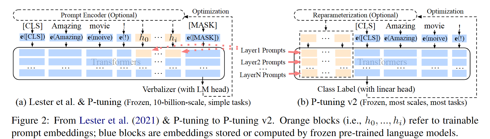
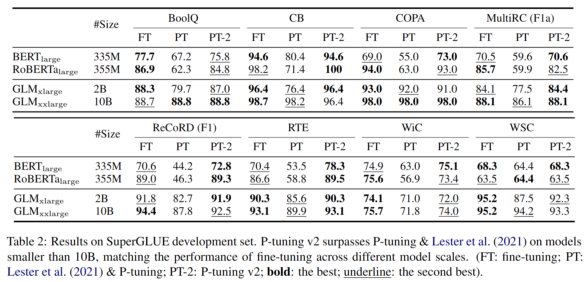

# 背景

Prompt tuning和P-tuning缺乏普适性

- 只有在模型规模超过10B时，prompt tuning效果才能与fine-tune相比
- 只擅长Natural Language Understanding(NLU)任务，在Sequence Tagging序列标注任务中（预测每个输入token的一组标签，如分词、词性标注、实体识别等）表现差

作者认为上述两种方案约束了可调节参数的数量，同时输入的嵌入序列与模型预的测结果之间的关系并不直接。

因此P-tuning v2利用深度prompt tuning的策略，在模型的每一层都加入了Prompt，在添加更多参数的同时，增强添加的Prompt与模型最终预测结果的相关性。

# 设计实现

注意到P-tuning v2与prefix tuning的方法类似，其贡献更多地是在细节上进行了优化

- Reparameterization：prefix tuning利用MLP之类的重参数化encoder对可训练的嵌入向量进行转化，而P-tuning v2发现NLU任务中并不一定需要MLP，其效果随任务不同，有时甚至会产生负优化
- Prompt Length：提示长度对P-tuning v2的性能非常重要，不同的NLU任务通常需要不同的提示长度。一般情况下，简单的分类任务需要更短的prompt（少于20），而困难序列标注任务需要长prompt（约100）
- Multi-task Learning：同时优化多个任务，任务之间共享prompts，但是效果一般
- Classification Head：使用语言建模预测verbalizers（使用一个token表示的任务类型）是prompt tuning的核心任务，但P-tuning v2发现这一任务对数据类型的任务并不必要，且和序列标注任务不兼容。因此他在tokens头部放了一个随机的分类头。

# 实验结果

