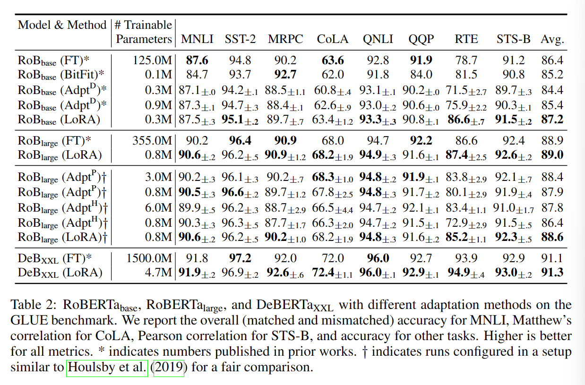

# LoRA

Adapter和Prompting是LLM中常用的轻量级微调方案。

Low-Rank Adaptation提出不改变预训练模型权重，而在模型外添加旁路，用训练旁路中的矩阵模拟微调过程。这种方法的优点是不引入额外延迟，只需要将旁路参数与模型参数合并，用新参数推理结果即可。

# 背景——微调原理

在2020年，一项由[Aghajanyan等人](https://arxiv.org/abs/2012.13255)进行的研究揭示了微调背后的原理。

fine-tune（微调）：基于规模较小的标注数据集，通过梯度下降等算法调整模型权重，将具有大量参数的预训练模型调整到指定任务上的过程

intrinsic dimensionality（本征维度）：目标函数达到精确解决优化问题所需的最小维度。

对预训练模型而言，衡量本征维度告诉我们在对每个任务进行微调时需要多少空余参数才能大概解决优化问题。

标准的预训练模型仅需少量参数就可以学习大量NLP任务，预训练本身实在为后续NLP任务调整最小化本征维度。因此，文章认为预训练实际上是一个学习如何压缩平均NLP任务的框架。

## 计算本征维度

计算目标函数的精确本征维度非常困难，可以使用启发式方法计算上界。

假设 $\theta^D=[\theta_0,\theta_1,...,\theta_m]$ 是模型 $f(·,\theta)$ 的D个参数。相比直接优化模型参数 $\theta^D$ 的损失函数，子空间方法通过低维参数化d个维度对模型进行微调：

$\theta^D=\theta^D_0+P(\theta^d)$

其中 $P:\mathbb{R}^d\rightarrow\mathbb{R}^D$，将参数从低维d映射到高维D。[Li等人](https://arxiv.org/abs/1804.08838)提出了3种映射方法，分别是random linear dense projection（随即线性密集映射）、random linear sparse projection（随机线性稀疏映射）、通过 Fastfood transform 进行随机线性映射。

### DID

文中主要采用 Fastfood transform，其定义为：

$\theta^D=\theta^D_0+\theta^dM，M=HG\Pi HB$

$M$ 可以被分解为Hadamard 矩阵 $H$，具有独立标准正规项的随机对角矩阵 $G$，一个等概率±1项的随机对角矩阵 $B$，随机排列矩阵 $\Pi$。微调过程中，只有 $\theta^d$ 是变量，其他都是定值（ $M$ 使用Fast Walsh-Hadamard Transform计算）。如果我们将 $M$ 约束为二进制矩阵，那么本征维度的计算被转化为一个稀疏问题的连续松弛，称为Direct Intrinsic Dimension (DID) 方法。

定义达到训练完整权重矩阵效果的90%为令人满意的效果，目标是寻找最小的维度d，使得调整效果达到训练完整权重矩阵准确率的90%（如果完整模型训练后准确率85%，那么调整后目标准确率为0.9*85%=76.5%），称其为维度 $d_{90}$。

### SAID

更进一步可以对模型中每一层的参数进行本征维度计算，称为Structure-Aware Intrinsic Dimension (SAID) 方法：

$\theta^D_i=\theta^D_{0,i}+\lambda_i P(\theta^{d-m})_i$

对于m层，我们从子空间 $\theta^d$ 中交换m个参数，对每一层联合学习 $\lambda$。

## 本征维度效果

- MRPC：包含约3700个训练样本的段落文本语义一致性预测任务
- QQP：包含约363k个训练样本的问题文本语义一致性预测任务

结论

- 预训练模型效果越好，本征维度越小
- 训练集规模越大，本征维度越大

# 介绍

现有方法缺点

- 完全更新模型参数：参数量过大，效率低下，存储所有微调后的模型相当困难
- Adapter：引入推理延迟，需要在效率和模型质量之间权衡
- prefix tuning（对prompt微调）：优化难度大，其性能在可训练参数中非单调变化。更重要的是，只保留一部分序列长度必然会导致下游任务可用的序列长度减少，可能导致模型性能不如其他方法。

Inspiration：根据背景中描述的研究，学习后的过参数化模型实际上处于一个低“intrinsic dimension”上，作者假设模型adaptation（和fine-tune类似，将模型迁移到一个指定任务上）过程中的权重变化矩阵同样有一个较低的内在秩。

提出方法：通过优化密集层在适应过程中的变化的秩分解矩阵来间接地训练神经网络中的一些密集层，而保持预先训练的权重冻结。

# 方法

神经网络包含许多密集层进行矩阵乘积。这些层中的权重矩阵通常具有全秩。当模型适应一个特定的任务时，研究表明预训练模型具有一个低“内在维度“，尽管被随机投影到较小的子空间，模型仍然可以有效学习。

因此，LoRA假设对模型权重的更新同样有一个低秩。现有预选连权重矩阵   $W_0\in\mathbb{R}^{d\times k}$ ，将权重更新表示为 $W_0+\bigtriangleup W=W_0+BA$，其中 $B\in\mathbb{R}^{d\times r},A\in\mathbb{R}^{r\times k}$，秩 $r\ll min(d,k)$。在训练中，与训练权重矩阵保持不变，不接受梯度更新，而将$A,B$作为训练参数矩阵。

对于原来的推理变换 $h=W_0x$，LoRA定义声明为：

 $h=W_0x+\bigtriangleup Wx=W_0+BAx$

使用随即高斯函数初始化A，使用0初始化B，因此$\bigtriangleup W$在训练开始时为0。

在Transformer结构中，自注意力模块有4个权重矩阵 $W_q,W_k,W_v,W_o$，MLP（多层感知器，一种前向神经网络）模块有2个权重矩阵。LoRA只微调 $W_q,W_k,W_v$ 中的一个，相当于为下游任务调整时只变更注意力权重，而不变化MLP模块。

# 实验

## 效果

对比实验在r=4的条件下运行

- Fine-Tuning (FT)：对模型所有参数进行梯度下降调优
- Bias-only or BitFit：只训练偏差向量
- Prefix-embedding tuning (PreEmbed)：向输入token中插入特殊token，这些特殊token包含可训练的词嵌入。prefixing 前置到输入prompt，infixing 将token附加到prompt
- Prefix-layer tuning (PreLayer)：对PreEmbed的拓展，在每一层Transformer之后，使用可训练的连接层代替激活函数。可训练参数规模与Transformer层数相关。
- Adapter tuning：Houlsby等人2019年提出在自注意力模块（或MLP模块）和后续连接层之间插入adapter层，adapter层包含2个全连接层，中间是非线性函数。此处称其为初始 $Adapter^H$。Lin等人2020年提出一个更有效的设计，旨在MLP模块和LayNorm操作后插入Adapter，称为 $Adapter^L$。另外两个不同的优化分别被称为 $Adapter^P$，$Adapter^D$。

### RoBERT

### GPT-3 175B

## 其他因素影响

基于GPT-3 175 进行实验

### 目标权重矩阵

### 秩r取值

