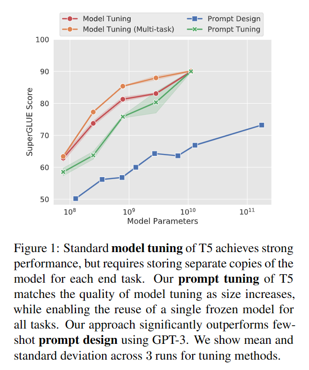
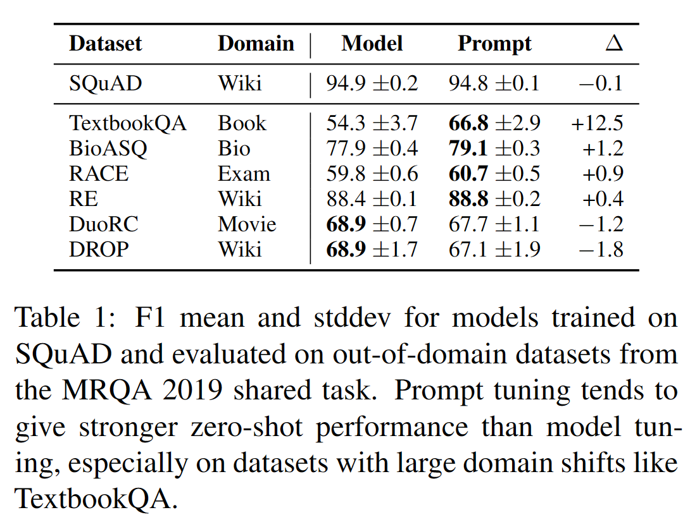
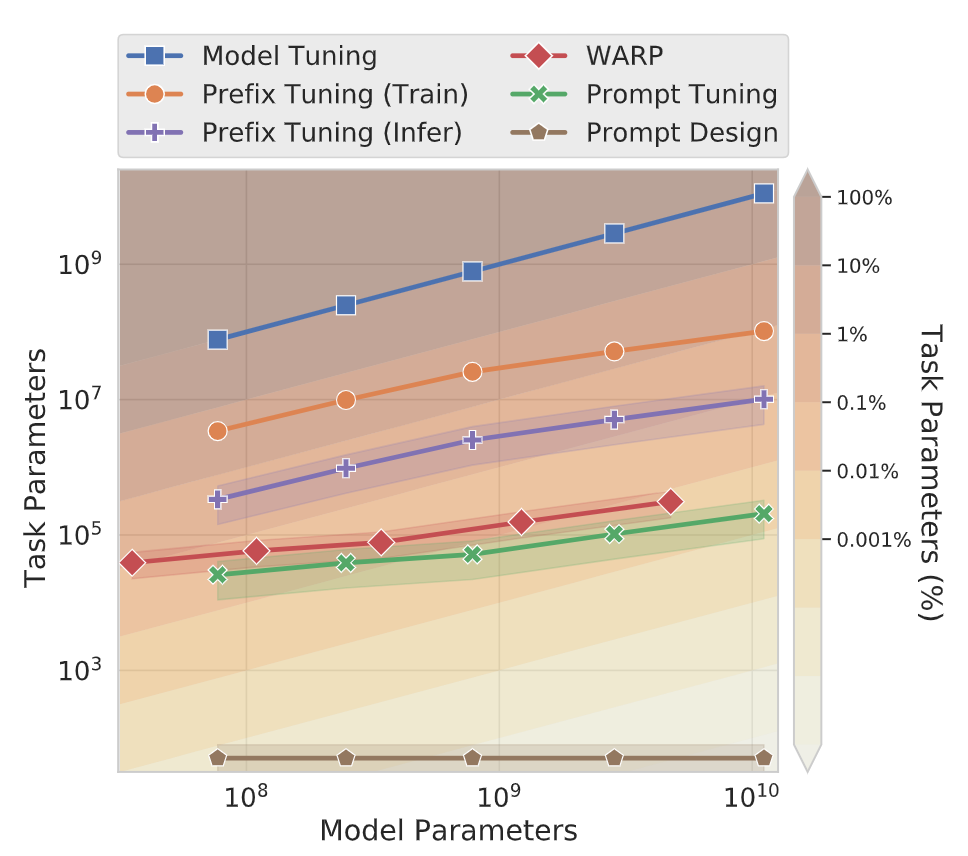

# 介绍

prompt design：设计特定的任务表述或数个样例，附加到原本模型输入。不需要对预训练模型进行微调，也不产生新模型。

缺点：

- 任务描述容易出错，且需要人工参与
- prompt的有效性受到与模型输入匹配程度的约束

## Soft Prompt

Soft Prompt：通过反向传播学习，可以被调整用于合并来自任意数量的标注样例的信号。

- **prefix tuning.** 由Li等人在2021年提出，在生成式任务中效果优秀。这一方法保留了模型参数，并通过反向传播错误，调整每个encoder层和输入层前置入的prefix激活函数。从而对不同任务的微调模型只需要保存其对应的prefix参数。

  

- **prompt tuning.** 保留完整预训练模型，仅允许每个下游任务有额外的k个可调整token置入于输入文本的头部。该方法prefix tuning的差别在于，他没有在中间层插入prefix或添加额外的输出层，仅仅对输入的prompt进行了调整。

# prompt tuning设计

## 生成式分类

prompt tuning采用和t5类似的方法，将所有任务映射为文本生成。

相比对类型基于输入进行概率建模 $Pr(y|X)$，文本分类任务被建模为条件生成，Y是表示类别标签的一个序列，prompting 会在输入前插入一系列tokens，P。prompt tuning提出使用单独的可更新参数来决定P的内容。由此得到分类概率建模：
$$
Pr_{θ;\theta_P}(Y |[P ; X])
$$
其中 $\theta$ 是模型参数，在优化过程中固定，只改变 $\theta_P$，来最大化概率函数。给定一组n个tokens，$\{x_1,x_2,...,x_n\}$。首先T5会嵌入输入序列形成矩阵 $X_e$，而prompt tuning在头部插入的prompt也被嵌入，形成矩阵 $P_e$，最终输入模型的是矩阵 $[P_e;X_e]$，相当于通过更新矩阵 $P_e$ 来最大化目标概率。

## 实现

1. "Span Corruption”：基于T5的预训练模型进行实现，T5的预训练进行句子空缺内容的预测，使用哨兵标注空缺位置，下面举个例子。

   - 输入：Thank you 〈X〉 me to your party 〈Y〉 week
   - 输出：〈X〉 for inviting 〈Y〉 last 〈Z〉

   其中输入中类似〈X〉的哨兵标注了空缺，输出表示对输入内容的填补，同样使用哨兵作为输出结尾

2. ”Span Corruption + Sentinel“：prompt tuning为了接近输入在预训练中的状态，微调时，向所有下游任务头部插入一个哨兵

3. “LM Adaptation”：延续T5进行少量额外的自监督训练，但以“LM”为目标（即Transformer中的解码器，基于上文预测下一个出现的token）。

   作者希望通过LM Adaptation，把模型速转换成一个更类似GPT-3的模型。

   由于这种方法与从头开始预训练的效果从未被比较过，文中尝试了不同量的Adaptation。

# 实验结果

使用额外的100K步训练 LM-adapted 版本的T5模型，并设置prompt长度为100个tokens，这种长度需要的参数数量仍然比其他方法需要的更少。

每个prompt参数训练只基于单个SuperGLUE任务，不支持多任务设置。训练时，将每个任务的名称插入到输入的头部来标识样例归属。

## 方法效果比较

## 方法参数量比较

