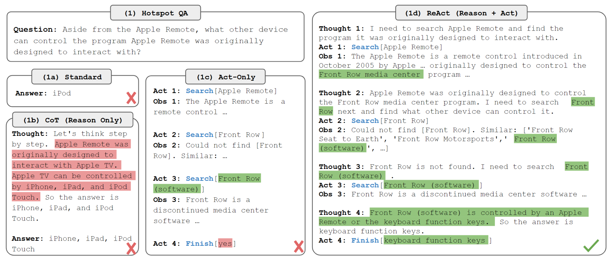
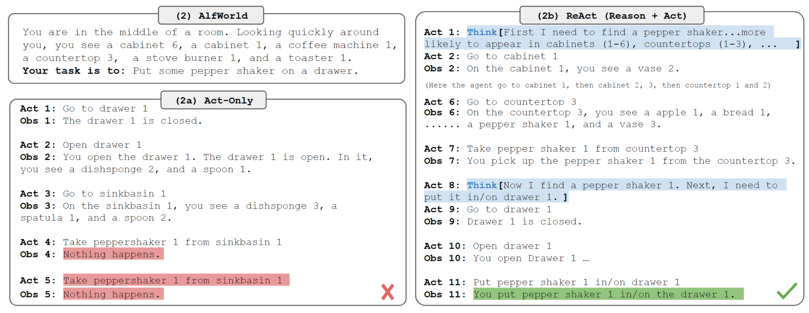
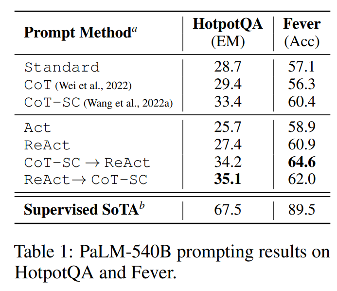
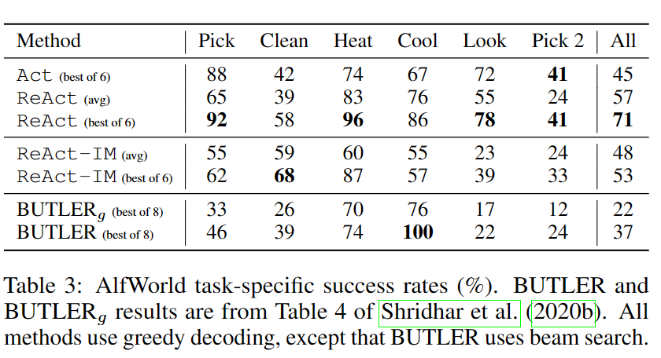
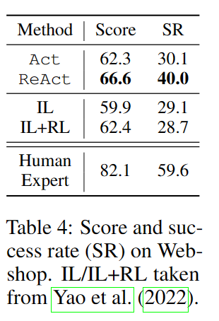

# 1.介绍

**ReAct：结合reasoning和acting。Reasoning允许模型进行模型归纳、跟踪和更新行动计划，甚至处理异常。Acting允许模型与外部资源（例如知识库或环境）交互并从中收集信息。**

传统的思维链方法虽然让模型实现了逐步推理得到结果的过程，但整个推理都基于模型的内部表示，而无法从外部世界获取信息，这限制了他的推理能力和知识更新能力。同时思维链中还会产生事实幻觉和错误传播等问题。

论文发布时，现有的方法只是实现了模型与几个模块交互的简单任务执行，还没有关于推理和行动如何以协同方式结合来解决一般任务的研究，以及与单独推理或行动相比，这种组合是否能带来性能提升的调研。

论文的具体贡献如下：

1. 提出了ReAct，在语言模型中实现协同推理和行动以解决一般任务
2. 在不同benchmark上广泛实验，验证了ReAct在few-shot任务中的优势
3. 进行了消融实验和分析，以了解在推理任务中采取行动和在交互任务中推理的重要性；
4. 分析了 ReAct 在prompt下的局限性（即对reason和act的有限支持），并进行了初始微调实验，显示了 ReAct 通过额外训练数据进行改进的潜力。


# 2.原理

考虑agent与环境交互以解决任务的一般设置。在时间阶段 $t$，agent从环境收到一个观察值 $o_t ∈ O$，基于策略 $\pi(a_t|c_t)$ 执行动作 $a_t\in A$，其中 $c_t = (o_1, a_1, · · · , o_{t−1}, a_{t−1}, o_t)$ 是agent的上下文。学习这样一个条件策略是非常困难的，如下图所示，常规方法无法解决需要对轨迹上下文进行复杂推理的QA任务（找出Apple remote的另一种控制设备）。



相似的，下图中单纯的动作执行没有充分理解上下文，误解了胡椒瓶所在的位置。




ReAct的想法很简单：将agent的动作空间扩大 $\widehat{A}=A\cup L$，其中 $L$ 是语言空间，语言空间的一个动作 $\widehat{a_t}\in L$ ，称之为思维（thought）或推理轨迹（reasoning trace），不影响外部环境，因此也不需要观察反馈。思维 $\widehat{a_t}$ 旨在通过推理当前上下文 $c_t$ 来组成更多的有价值信息，并更新上下文 $c_{t+1}=(c_t,\widehat{a_t})$ 来支撑下一步推理或动作。**思维有多种作用，如分解任务目标、导入任务相关的常识信息、提取观察中的重点部分、跟踪进度并更新计划、解决报错并调整计划等等。**

关键问题在于语言空间 $L$ 不受限制，需要强语言前提。文中主要关注通过few-shot prompt提供上下文示例来生成特定领域的动作和各种形式的语言思维以解决任务。**对于高度依赖推理的任务，思维和动作交替进行**，使得过程包含多个thought-action-observation步骤。**而对于决策类型的任务（包含大量的动作），思维只需要稀疏地出现在最关键的位置，**由模型决定思维和动作的出现位置。


# 3.知识密集型推理任务

通过与维基百科 API 交互，ReAct 能够检索信息以支持推理，同时还使用推理来确定接下来要检索的内容，展示了推理和行动的协同作用。实验使用2个数据集——HotPotQA、FEVER。

## 动作空间

论文设计了简单的维基百科API，它具有三种类型的操作来支持交互式信息检索：

1. **search[entity]**，如果存在，则返回相应实体 wiki 页面的前 5 个句子，否则从维基百科搜索引擎返回前 5 个相似实体；
2. **lookup[string]**，它将返回包含string的页面中的下一个句子，模拟浏览器上的 Ctrl+F 功能；
3. **finish[answer]**，用answer结束当前任务。

值得注意的是，这个动作空间只能根据准确的段落名称检索段落的一小部分，这明显弱于最先进的词汇或神经检索器。这样设计的目的是模拟人类与维基百科的互动方式，并强制模型通过语言的显式推理进行检索。


## 方法

对于 HotpotQA 和 Fever，我们从训练集中随机选择 6 个和 3 个案例，手动构建ReAct格式的思维轨迹，组成few-shot prompts，每条轨迹都由多个思维-行动-观察步骤组成。如上文描述的，自由形式的思维用于实现不同的任务，如分解问题、提取信息、执行常识/算术推理、指导搜索公式和综合最终答案。

由于手动标注大规模推理过程和动作非常困难，考虑使用3000个现有的思维轨迹微调较小的语言模型 (PaLM-8/62B) ，用于基于输入解析思维轨迹。

## 实验效果

- **Standard**：只给出问题-回答作为示例
- **Chain-of-thought（CoT）**：移除动作和观察
- **Self-Consistency Chain-of-thought（CoT-SC）**：在CoT的基础上使用不同结构的推理路径，生成多个答案，取其中出现次数最多的。

上述方法中，ReAct所展示的问题解决过程更具事实性和基础性，而CoT在制定推理结构方面更准确，但很容易产生幻觉的事实或想法。文中结合ReAct和CoT-SC，并让模型根据以下启发法决定何时切换到另一种方法

- **ReAct → CoT-SC**：当ReAct没有在规定步数内返回结果时，采用CoT-SC
- **CoT-SC → ReAct**：当n个CoT-SC给出的答案中主流答案占比低于二分之一时，采用ReAct



# 4.决策型任务

在ALFWorld和WebShop这两个基于语言的交互式决策任务上测试了ReAct，两个任务都具有复杂的环境，代理需要在长期动作中以稀疏的奖励激励行动，强调推理来进行高效探索。

- ALFWorld：文本类游戏，它包括6种类型的任务，在这些任务中，代理需要通过文本动作（例如去咖啡桌1、拿纸2、使用台灯1）导航和与模拟家庭互动来实现高级目标（例如在台灯下检查纸张）。
- WebShop：在线购物网站环境，包含118万个真实世界的产品和12千条人工指令。与ALFWorld不同，网店包含多种结构化和非结构化文本，通过网络互动购买产品

## 实验效果

- ALFWorld
  -  Inner Monologue（IM）：内心独白，所有动作前增加一段“内心独白”，与思维不同的是，IM受限于对环境的观察和实现目标需要满足的条件，而推理轨迹可以稀疏存在且支持更丰富的类型。
  - ReAct-IM：使用IM替换思维（内部推理）。由于缺乏高层目标分解，ReAct-IM在确定子目标何时完成或下一个子目标应该是什么时经常出错。此外，由于缺乏常识性推理，许多ReAct IM轨迹难以确定物品可能在ALFWorld环境中的位置。



- WebShop

  - imitation learning（IL）：模仿学习，训练机器模仿人类的连续动作，与环境交互

  - reinforcement learning（RL）：强化学习，通过奖励函数提高机器在特定指标上的表现




# 5.LangChain ReAct

LangChain中集成实现了ReAct框架，可以直接使用ReAct来建立agent执行任务，结合LLM和其他工具。[官方文档](https://python.langchain.com/docs/modules/agents/agent_types/react_docstore)

```python
from langchain.agents import load_tools
from langchain.agents import initialize_agent
from langchain.agents import AgentType
from langchain.llms import OpenAI
llm = OpenAI(model_name="text-davinci-003" ,temperature=0)
tools = load_tools(["google-serper", "llm-math"], llm=llm)
agent = initialize_agent(tools, llm, agent="zero-shot-react-description", verbose=True)
```

